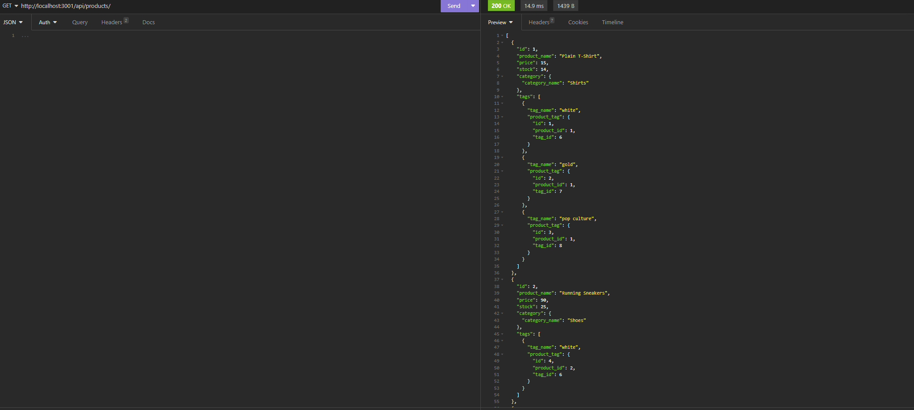

# The Absolute Taco 

## Description

The Absolute Taco is a back end e-commerce that was developed using the stater code. It uses Sequelize ORM and MySQL to create the backend for a hypothetical e-commerce website

## Table of Contents

If your README is long, add a table of contents to make it easy for users to find what they need.

- [Installation](#installation)
- [Usage](#usage)
- [Project](#project)

## Installation

1. to install run npm install into the integrated terminal
2. update the .env file to include the mysql credentials
3. then type npm run seed to set the seed data
4. type npm run start to begin the server

## Usage

to use this e-commerce backend we'll be using insomnia to perform the routing actions.

this is the main product page using the get command to get all the available products

## Features

you are able to view all information in the database as well as able to update, add or delete information through the get, put, post and delete commands respectively

## project

github-https://github.com/Jgarnaat/Absolute-Taco